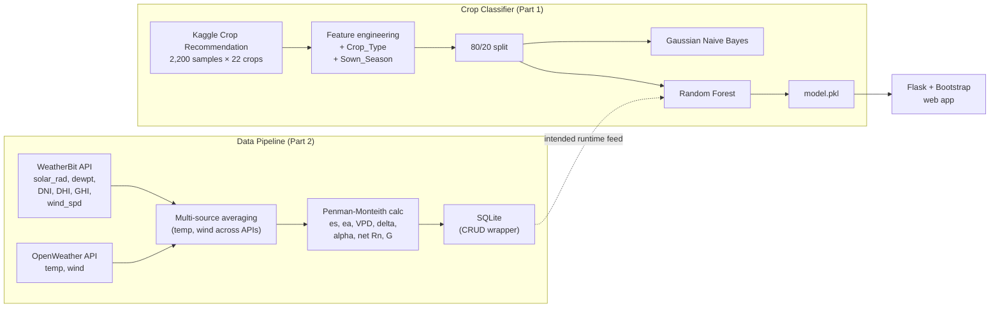

A two-part agricultural decision-support project. **Part 1** is a 22-class crop classifier that recommends what to grow given soil + climate features. **Part 2** is the data pipeline that would feed the classifier from real-world sensors and weather services — built around the Penman-Monteith evapotranspiration model.

## Architecture



## Part 1 — Crop classifier

**Data:** the standard Kaggle Crop Recommendation dataset — 2,200 samples balanced across 22 crops (rice, maize, jute, cotton, coconut, papaya, orange, apple, muskmelon, watermelon, grapes, mango, banana, pomegranate, lentil, blackgram, mungbean, mothbeans, pigeonpeas, kidneybeans, chickpea, coffee), 100 per class. Features: N / P / K (soil nutrients), temperature, humidity, pH, rainfall.

### Feature engineering

Two derived features from the crop label:
- **`Crop_Type`** — Fruit / Grain / Fiber — collapsing 22 classes into a 3-class taxonomy that lets EDA plots group by botanical category.
- **`Sown_Season`** — Summer / Winter — captures the planting calendar (one-hot encoded after derivation).

### EDA driven by the taxonomy

With `Crop_Type` available, the notebook generates per-category nutrient distributions (N / P / K) and per-category climate distributions (temperature / humidity / pH / rainfall) — making it easy to spot, for example, that fiber crops sit in a tighter N range than grain crops.

### Models

Gaussian Naive Bayes ran as a baseline. The deployed model is a **Random Forest classifier** — picked over Naive Bayes for its better tolerance to feature noise — which hits ~96% accuracy on the test split.

**Honest caveat:** the Kaggle Crop Recommendation dataset is balanced and largely synthetic — its classes are well-separated by feature value alone. The 96% reflects that the dataset is well-suited to a simple classifier, not that the model would generalize to messy field readings without further validation. The interesting work in this project is the *pipeline around the model*, not the model itself.

### Deployment

Random Forest pickled to `model.pkl`; label encoder pickled separately. **Flask + Flask-Bootstrap web app** with two routes: `GET /` renders an input form, `POST /predict` parses form inputs (with a Summer/Winter → 1.0/0.0 mapping for the season dropdown) and returns the predicted crop.

## Part 2 — Soil-moisture data pipeline

A separate workstream that lays the ground for replacing hand-entered classifier inputs with live weather + soil signals. The pipeline computes evapotranspiration (ET) inputs via a **Penman-Monteith** formulation — the standard agronomic equation for reference ET.

### The equation in code

```
ET = (0.408·Δ·(Rn − G) + γ·[900 / (T + 273)]·u₂·(es − ea))
     ────────────────────────────────────────────────────
              Δ + γ·(1 + 0.34·u₂)
```

Each input is computed from API data:

- `es` (saturation vapor pressure) — derived from dew-point temperature
- `ea` (actual vapor pressure) — derived from air temperature
- `Δ` (slope of vapor-pressure curve) — derived from `es` and temperature
- `α` (albedo) — derived from solar irradiance components: `1 − (DNI + DHI) / GHI`, with a safe fallback to 1 when GHI is zero
- `Rn` (net radiation) — `(1 − α)·Rs / 1.14`
- `G` (soil heat flux density) — `0.14·Rn`

### Multi-source weather aggregation

Temperature and wind speed are pulled from *both* WeatherBit and OpenWeather and averaged — defensive against single-source bias or transient API failures. The remaining inputs (solar radiation, DNI/DHI/GHI, dew-point) come from WeatherBit only since OpenWeather doesn't expose them on the free tier.

### Persistence

A small `DatabaseCRUDOperations` wrapper class fronts SQLite. The pipeline iterates a list of (city, lat, lon) tuples from an Excel input file, hits both APIs, runs the Penman-Monteith calculation, batch-builds an `INSERT` statement, and persists to a `Soil_Moisture` table keyed by city + datetime.

## What I'd revisit

- **Validation against a published agronomic dataset** — Penman-Monteith outputs should be sanity-checked against FAO-56 reference values to confirm the implementation matches the literature.
- **Add an `Sown_Season` lookup table** in the database to mirror the classifier's training schema — the runtime input vector then becomes fully derivable from `(latitude, longitude, datetime)`.

[View on GitHub →](https://github.com/Abhijith-Nagarajan/Agriculture_Crop_Recommendation)
