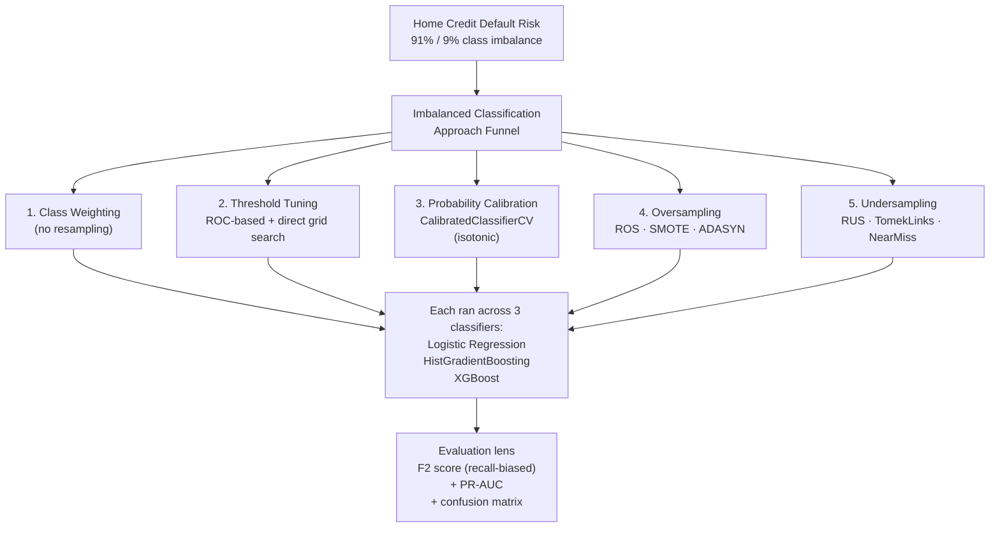

A two-notebook study on the **Home Credit Default Risk** dataset — the canonical real-world imbalanced classification problem (91% non-defaulters vs 9% defaulters). The interesting question wasn't "can a model hit 99% accuracy" (a constant `predict(0)` already does that — and is useless). It was: *for a problem where the minority class is the one that matters, which combination of techniques actually moves the needle?*

The work splits into a [companion EDA notebook](https://www.kaggle.com/code/itsabhijith/loan-defaulter-analytics-eda-preprocessing) (missing-value handling, feature engineering, demographic-level defaulter analysis) and this modeling notebook.

## The approach funnel

## Choosing the evaluation metric first

In imbalanced classification, the metric you pick *is* a design decision. Accuracy is misleading at 91/9 — a no-skill classifier gets 91% by predicting the majority class everywhere. So:

- **F2 score** — F-beta with β=2 puts twice the weight on recall as on precision. For a defaulter classifier, a false negative (missed defaulter) is more expensive than a false positive (extra manual review). F2 captures that.
- **PR-AUC** (precision-recall area under curve) — preferred over ROC-AUC when the positive class is rare, because it doesn't get inflated by the easy negative class.
- **Confusion matrix** alongside — to actually see where errors land.

Every model in the notebook was scored on all three, never on raw accuracy.

## Approach 1 — Class weighting (no resampling)

The cheapest move: pass `class_weight='balanced'` to the classifier and let it reweight the loss. Tried with Logistic Regression and HistGradientBoosting; Optuna with 100 trials tuned `C`, `tol` (Logit) and `learning_rate`, `max_iter`, `max_depth`, `min_samples_leaf` (HGB).

## Approach 2 — Threshold tuning

A standard classifier's `predict()` uses a 0.5 probability threshold. For imbalanced problems, that's almost always wrong. Two methods tried:

- **ROC-curve thresholding** — compute precision and recall at all thresholds from the PR curve, pick the threshold that maximizes F2.
- **Direct grid search** — sweep 0.001 → 1.0 in steps of 0.001, evaluate F2 at each, pick the best.

ROC thresholding gave higher AUC. Direct grid search produced fewer false positives but worse F2. Different operating points — the "right" one depends on the cost ratio between missed defaulters and false alarms.

## Approach 3 — Probability calibration

A model that scores 0.8 should be right 80% of the time. Most boosters aren't natively calibrated. Plotted the reliability diagram (predicted probability vs. observed frequency) and saw deviation from the diagonal, so applied `CalibratedClassifierCV(method='isotonic', cv='prefit')` on a held-out validation slice. Brier score logged before/after to confirm.

Threshold tuning on the calibrated classifier produced more interpretable score outputs (useful if a downstream decision needs the actual probability, not just a label).

## Approach 4 — Oversampling

Three variants tried, applied **only to the training set after the stratified split** (oversampling the test set would leak):

- **Random Over Sampler** — duplicates minority-class rows
- **SMOTE** — synthesizes minority-class points by interpolating between near neighbors
- **ADASYN** — like SMOTE, but oversamples more aggressively where the minority class is hardest to learn

Each of the three was paired with all three base classifiers.

## Approach 5 — Undersampling

- **Random Under Sampler** — random majority-class subset
- **TomekLinks** — removes majority-class points that form Tomek pairs with minority points (cleans the decision boundary)
- **NearMiss** — keeps majority-class points closest to the minority class

Same three base classifiers across each undersampler.

## Cross-validation note

Two splitting strategies compared:
- **Single stratified train/test split** — fast, used for most approach comparisons
- **Stratified 10-fold** — added later to confirm whether observed approach differences held up across folds (they did)

## What the study actually showed

- **Final result: 0.55 PR-AUC** with **Logistic Regression and HistGradientBoosting**, combining class weighting and threshold tuning. The two model families landed at comparable PR-AUC; the simpler one (Logistic Regression) was preferable for interpretability while HGB held a small edge on borderline cases.
- **Threshold tuning is the cheapest, highest-leverage move.** It costs nothing at training time and consistently moved F2 and PR-AUC more than swapping classifiers.
- **XGBoost was tested across the same approach matrix** but didn't justify the added complexity over class-weighted Logistic Regression / HGB for this dataset.
- **Calibration matters when the downstream consumer needs probabilities, not labels.** Bank decisioning typically needs probabilities — so the calibrated variant is what you'd ship to a risk team even if F2 is slightly lower.
- **Direct threshold search vs ROC thresholding** are different operating-point choices, not different qualities. The right one depends on the asymmetric cost of false negatives vs false positives — which is a business decision, not an ML one.

## Companion EDA work

The EDA notebook does the work that makes the modeling tractable:

- **Missing-value triage** — 14 features dropped (50–70% missing), categorical missingness encoded as its own `Missing` category, `OWN_CAR_AGE` imputed to `-1` when `FLAG_OWN_CAR=N` (preserving the semantics of the absence).
- **Feature engineering** — `DAYS_BIRTH → Applicant_Age`, `DAYS_EMPLOYED → Years_Employed`, LTV (loan-to-value) ratio from `AMT_CREDIT / AMT_GOODS_PRICE`.
- **Preprocessing for modeling** — RobustScaler on the numeric features, feature hashing for high-cardinality categoricals, and PCA / Truncated SVD for dimensionality reduction before training.
- **Defaulter demographic analysis** — gender × car ownership × property ownership cross-tabs, applicant age vs. default rate, occupation × organization-type income patterns.

## What I'd revisit

- **Bayesian decision theory layer** — instead of picking one threshold, ship the calibrated probability + an explicit cost matrix so the threshold is set by the business cost ratio rather than F2 optimization.
- **Cost-sensitive learning natively** — XGBoost's `scale_pos_weight` and HGB's `class_weight` were used; a true asymmetric-cost objective (different penalty per FN vs FP) would be closer to the real loss.
- **Stratify by more than just the target** — at 91/9, also stratifying by income band or region rating during k-fold would reduce variance across folds.

[View the modeling notebook on Kaggle →](https://www.kaggle.com/code/itsabhijith/loan-defaulter-sampling-modeling)
