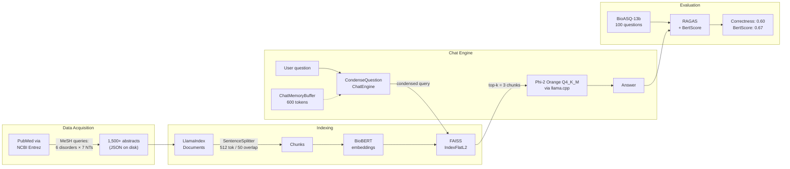

The project sits at the intersection of AI, psychology, and neuroscience. The chatbot links neurotransmitters (dopamine, serotonin, GABA, glutamate, norepinephrine, acetylcholine, endorphins) to mood disorders (depression, anxiety, bipolar, schizophrenia, OCD, PTSD), and surfaces how nutrition, exercise, and lifestyle affect well-being.

## Architecture

- **Data acquisition** — 1,500+ PubMed abstracts scraped via Biopython Entrez. MeSH queries built from a Cartesian product of 6 disorders (depression, anxiety, bipolar, schizophrenia, OCD, PTSD) × 7 neurotransmitters (dopamine, serotonin, GABA, glutamate, norepinephrine, acetylcholine, endorphins), persisted as JSON.
- **Indexing** — BioBERT embeddings (biomedical NLI/STS fine-tune) feeding a FAISS `IndexFlatL2` vector store; `SentenceSplitter` with 512-token chunks and 50-token overlap.
- **Retrieval + generation** — LlamaIndex `CondenseQuestionChatEngine` with a `ChatMemoryBuffer` for multi-turn follow-ups; local quantized GGUF LLM (Phi-2 Orange Q4_K_M) via `llama.cpp`. No paid APIs at inference time.
- **Evaluation** — RAGAS `AnswerCorrectness` against the first 100 BioASQ-13b training questions and their cited PMIDs, with the same local Phi-2 model wrapped as the judge.

## Key design decisions

- **Local quantized model** for reproducibility and zero API cost. The small context window directly shaped top-k, chunk size, and memory-buffer choices.
- **BioBERT over generic sentence-transformer** — domain match beat model size for jargon-dense PubMed text.
- **FAISS `IndexFlatL2`** (exact search) at sub-1k vectors removes recall variance as a confound when tuning the rest of the pipeline.
- **BioASQ for evaluation** — peer-reviewed biomedical QA benchmark with curated answers, a stronger signal than self-generated ground truth.

## Results

Final evaluation on the BioASQ-13b subset:

- **RAGAS Answer Correctness**: 0.6
- **BertScore**: 0.67

## Open threads

- Hybrid retrieval (BM25 + dense) for rare-term queries like specific drug names and gene IDs.
- Cross-encoder reranker between retrieval and generation.
- Larger or hosted judge model for higher-confidence evaluation.
- Branched/adaptive RAG routing lifestyle vs. mechanism questions to different sub-indexes.

[View on GitHub →](https://github.com/Abhijith-Nagarajan/Mental_Health_Chatbot)
