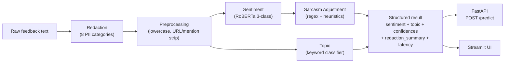

An end-to-end NLP system that classifies product feedback by sentiment and topic, redacts PII before any transformer sees the text, and corrects for sarcasm — a failure mode transformer sentiment models systematically miss. Same `InferencePipeline` instance powers both the REST API and the UI; no logic forks between surfaces.

## Architecture

Each stage is an independently testable component and can be swapped at runtime via constructor injection. `replace_*` methods on `InferencePipeline` allow hot-swapping any stage without rebuilding — useful for A/B comparisons and evaluation harnesses.

## Components

- **Redaction** — 8 PII categories (email, phone, credit card, SSN, IPv4, URL, API key, password) detected via regex and replaced with typed tokens (`[EMAIL_REDACTED]`, etc.) **before** the text ever reaches the transformer. A `redaction_summary` dict (counts by category) is returned with every prediction so callers know what was sanitized.
- **Sentiment** — `cardiffnlp/twitter-roberta-base-sentiment` (3-class) with classifier-head shape auto-detected from `config.num_labels`. Twitter-specific preprocessing (`@user → @USER`, hashtag stripping, URL spacing) mirrors the model's training distribution. Collapsed to binary with a *negative-bias* rule (`P(neg) > 0.3` flips to negative) to fix the common failure mode where mildly-negative reviews get scored `neutral → positive`.
- **Topic** — 7 Apple product categories handled by a hand-curated keyword classifier (a transformer would be overkill for a fixed taxonomy). Multi-word keywords like `"apple watch"` weighted by token count to outrank single-word collisions. Same `predict()` contract as the transformer-backed models, so the pipeline doesn't know the difference — passing `model_name=…` swaps in a fine-tuned HF classifier with zero pipeline changes.
- **Sarcasm adjustment** — Pattern-based detector runs in parallel: 6 regex patterns covering positive-word + negative-outcome, exaggerated-positive + complaint, irony indicators; a contradiction-phrase list; and a positive/negative-word proximity check (≤ 75 chars). Confidence is the sum of pattern weights, capped at 1.0. Above threshold (0.3), `adjust_sentiment()` either flips the label or attenuates the confidence based on how confident the sarcasm detector is — the original RoBERTa prediction is never blindly overridden.
- **Serving** — FastAPI (`POST /predict`, `/predict/batch`, auto-generated OpenAPI/Swagger at `/docs`) and Streamlit UI (single-text, batch, and model-details tabs) both consume the same `InferencePipeline` instance. `@st.cache_resource` caches the model once per Streamlit session rather than per interaction.

## Key design decisions

- **PII redaction before tokenization.** Sensitive data is gone before the transformer (or any downstream log/embedding/vector store) sees it. Detection-only mode (`is_sensitive()`) is also exposed for upstream guardrails.
- **Sarcasm correction as adjustment, not replacement.** Transformer sentiment models systematically miss sarcasm, but sarcasm detectors have their own false positives. Adjusting the final score (rather than overriding the label outright) preserves the RoBERTa signal when sarcasm confidence is borderline.
- **Keyword classifier for topic, transformer-backed `predict()` contract.** A small fixed product taxonomy doesn't warrant a model. Keeping the same interface means the pipeline orchestrator never needs to know which backend is in use.
- **Constructor injection for every stage.** Every component is swappable without rebuilding the pipeline. Evaluation harnesses can iterate through component variants without restart.

## Engineering hygiene

- CUDA detection with a guarded fallback to CPU when `torch.cuda.is_available()` itself throws.
- Prefers `safetensors` weights with a clean fallback to the legacy format.
- `low_cpu_mem_usage=True` for low-RAM environments.
- DeBERTa-specific tokenizer fix (`use_fast=False`) to dodge a known upstream bug.
- Cross-platform error handling: PyTorch DLL load failures on Windows produce an actionable message pointing at the VC++ redistributable rather than an opaque stack trace.
- Per-prediction `inference_latency_ms`, plus `batch_avg_latency_ms` and `total_batch_time_ms` for batches.

[View on GitHub →](https://github.com/Abhijith-Nagarajan/pii-aware-sentiment-pipeline)
