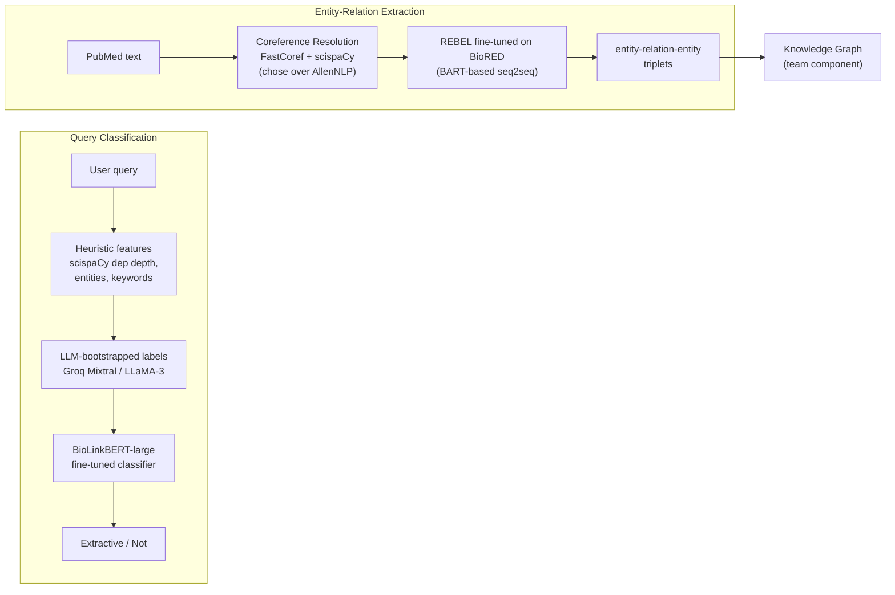

A graduate research project at UIUC (CS 546, Fall 2024) proposing **SHERPA** — a semi-structured non-parametric memory framework that integrates a knowledge graph with a hierarchical vector store to improve retrieval-augmented generation. Five-person team; this page covers **my two contributions**: Query Classification and Entity-Relation Extraction.

The interesting story isn't the destination — it's the experimental funnel. Both contributions involved walking through multiple wrong-fits before landing on the architecture that shipped.

## Architecture (my contributions)

## Contribution 1 — Query Classification

**The goal:** label a biomedical question as *strongly extractive* (factual lookup) vs *not extractive* (reasoning required), so downstream stages can route accordingly. Dataset: BioASQ-12B (5,049 questions across four types: factoid, yesno, summary, list).

**The funnel:**

### 1. Heuristic features alone
First instinct: derive signal from the question's syntax/structure.

- Query keyword analysis (factual keywords, hypothetical keywords, superlatives)
- Dependency-tree depth via **scispaCy** (`en_core_sci_md`) — biomedical-aware parser
- Entity count and unique entity types per question

Why this wasn't enough: heuristics captured *form* but not *semantic complexity*. A short question can be deeply abstractive ("How does HNF-6 variability cause Type II diabetes?").

### 2. LLM-only classification
Switched to Groq-hosted LLMs (Mixtral-8x7B, LLaMA-3-8B, LLaMA-3.1-8B-Instant) with a guideline-rich system prompt and chat-history memory.

Engineering that turned out to matter:
- **Multi-model fallback chain** — when a model hit rate limits, code swapped to the next
- **Memory error handling** — caught 413 ("Request too large") and truncated conversation memory before retry
- **Batch resumption** — labelled in 25-question batches with on-disk checkpoints so a Colab disconnect didn't lose progress

Result: 70% accuracy, F1 0.64. Good — but LLM-only inference at production scale would be slow + expensive.

### 3. Final: LLM bootstraps labels → fine-tune a smaller classifier
**The hybrid pattern.** Used the LLM not as the runtime classifier, but to *label* the training set (2,076 questions: 1,446 positive, 630 negative). Then fine-tuned **BioLinkBERT-large** (`michiyasunaga/BioLinkBERT-large`) on those labels.

- HuggingFace `Trainer` with `EarlyStoppingCallback`, cosine LR schedule, warmup steps
- Eval every 100 steps, save best by F1
- Increased dropout to 0.3 to fight label noise

This amortizes the LLM cost across a one-time labeling pass, then inference is fast via a domain-tuned BERT.

| Method | Accuracy | F1 |
|---|---|---|
| LLM-Based (Mixtral / LLaMA-3) | 70% | 0.64 |
| XGBoost | 64% | 0.64 |
| Random Forest | 63% | 0.63 |

## Contribution 2 — Entity-Relation Extraction (the experimental funnel)

**The goal:** extract `<subject, predicate, object>` triplets from PubMed abstracts so the team could build a domain knowledge graph.

This was the part of the project with the most reversed-course exploration. Each negative result narrowed the design space.

### Approaches tried (and abandoned)

**sciSpaCy NER (`en_core_sci_md`, `en_ner_jnlpba_md`)** — generic biomedical NER. *Abandoned.* JNLPBA's gene/protein/cell-line/cell-type/DNA/RNA taxonomy was too narrow for the open-domain biomedical entities we needed (diseases, drugs, treatments, mechanisms). My notebook header literally says: *"DOES NOT WORK - DO NOT USE - TOO NICHE."*

**SciBERT for NER** — pretrained on scientific text. *Abandoned.* Pretrained base model produced incoherent NER output; the heading reads *"Requires fine-tuning. Pretrained base model is incompetent."* Even if fine-tuned, this still leaves you in a two-stage pipeline (NER → RE) where errors in stage 1 propagate.

**SciDeBERTa** — same NER-then-RE two-stage problem.

**KeyBERT keyword extraction** — surfaced salient terms but didn't produce typed relations. Wrong lens for building a KG.

**T5-small fine-tuned on SciERC** — first move toward joint seq2seq extraction. SciERC's scientific-paper triplets didn't match biomedical phrasing tightly enough, and T5-small had limited capacity.

**Stanford OpenIE** — domain-agnostic, no biomedical vocabulary lift.

**Relik (Sapienza NLP)** — strong at entity linking but not at producing labeled relations in REBEL's format.

### What I landed on: REBEL fine-tuned on BioRED

REBEL (`Babelscape/rebel-large`) is BART-based seq2seq, trained to emit triplets in the exact format `<triplet> entity1 <subj> entity2 <obj> relation`. Three properties made it the right end-point:

1. **Joint extraction in one pass.** No NER-then-RE error compounding.
2. **Native triplet format** — the output is directly graph-edge-shaped, so the team's KG-building code didn't need a custom parser.
3. **Pretrained on relation extraction specifically**, so the BioRED fine-tune transfers cleanly.

**Fine-tuning setup:**
- Custom `transform_biored_to_rebel_format` — BioRED's nested per-passage annotations → REBEL `<triplet>` strings, consolidated to single multi-relation triplet tags per head entity (e.g., `<triplet> head <subj> tail1 <obj> rel1 <subj> tail2 <obj> rel2`)
- 10 epochs, LR 5e-5, batch size 4 with gradient accumulation 2, weight decay
- Custom `compute_metrics` doing set-based precision / recall / F1 on extracted triplet sets (not surface BLEU)
- Final checkpoint: `BioRED_Results/checkpoint-135`

### Coreference resolution upstream

Before any extraction, pronouns and definite references must resolve to their entities or REBEL extracts triplets like `<she, won, Nobel Prize>`. Tested **AllenNLP** vs **FastCoref**: FastCoref produced cleaner clusters on biomedical text and ran on GPU. Wrote a custom replacement layer (`improved_replace_corefs`, `get_span_noun_indices`, `get_cluster_head`) that picks the noun-headed mention from each cluster — important on biomedical text where some cluster spans are adjectival or possessive and shouldn't be the canonical form.

### Production wrapper

Final pipeline encapsulated as a `RelationExtractor` class (constructor takes the scispaCy model, FastCoref model, REBEL model + tokenizer, and a data slice):
- `filter_data` → light text cleanup
- `process_coreference_resolution` → coref-resolved text
- `process_triplet_extraction` → sentence-level batches through REBEL
- `aggregate_triplets` → deduped set across all sentences, optionally written to file

Ran across five PubMed clusters (clusters of similar abstracts produced by the team's Matryoshka-embedding clustering step).

### A separate experiment: Groq for label refinement

While REBEL was being fine-tuned, I ran a parallel track in `Groq_Testing.ipynb` using LLaMA-3 / Mixtral as the *triplet annotator* — feeding ground-truth BioRED passages + their gold triplets to a Groq model and asking it to refine the relation spans against the actual passage text. This produced higher-quality training labels than the raw BioRED labels for fine-tuning the next REBEL iteration.

## Results from the team paper

Numbers reported in the SHERPA paper that touch my contributions:

- **Query Classification**: 70% accuracy (LLM) / F1 0.64 — competitive with traditional ML methods (XGBoost 64% / F1 0.64) but more nuanced on complex queries.
- **REBEL inference** examples on BioRED test triplets show high overlap with ground truth; failure modes are mostly relation-direction errors (`Positive-Correlation` vs `Negative-Correlation`) on rare biomedical relations.
- **Overall SHERPA pipeline** on BioASQ-12b: avg cosine similarity 0.7332 against ground-truth answers — including downstream KG retrieval and query expansion, which my ERE output feeds into.

## What I'd revisit

- **Stronger evaluator** — the REBEL fine-tune's `compute_metrics` did set-based triplet matching. A more nuanced metric (e.g., partial credit for correct entity pair but wrong relation type) would have given a less brittle picture during training.
- **Active learning loop** — instead of one-shot LLM-bootstrapped labels for query classification, route the BioLinkBERT classifier's low-confidence predictions back through the LLM for re-labeling.
- **Distilled REBEL** — at inference time the fine-tuned REBEL is large for sentence-level extraction. A distilled variant would make the ERE step practical for larger corpora.

[View on GitHub →](https://github.com/Abhijith-Nagarajan/CS_546_Project)
